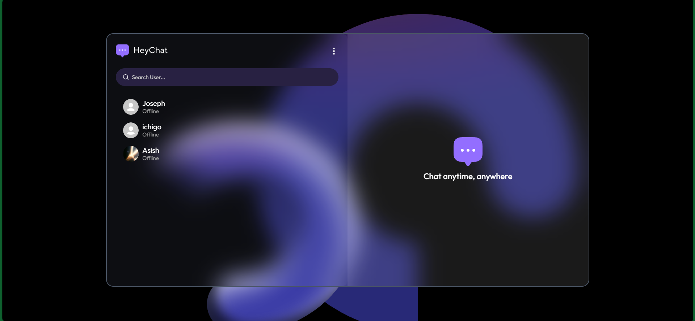
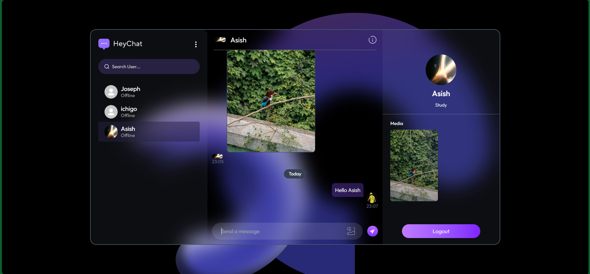
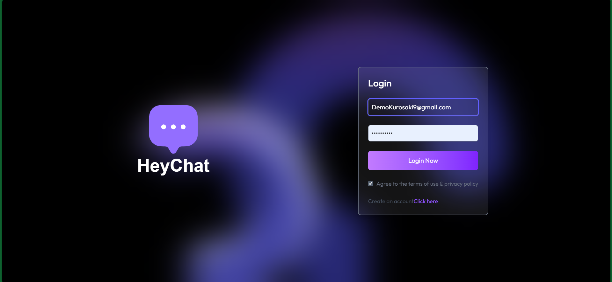

# 💬 HeyChat - Real-Time Chat Application

A scalable real-time chat application developed using the MERN stack and Socket.IO, supporting instant one-to-one messaging, live user presence tracking, and media sharing within a responsive and intuitive interface.

Designed with a focus on low-latency communication, smooth user experience, and scalable real-time architecture.

---

## 🌐 Live Demo

👉 https://heychat-blush.vercel.app/

---

## 🚀 Features

### 👤 User Features

* 🔐 JWT-based Authentication (Login / Signup)
* 💬 Real-time one-to-one messaging using Socket.IO
* 🟢 Online / Offline user status
* 🖼️ Image sharing in chat
* 🔔 Instant message updates without refresh
* 📱 Fully Responsive (Mobile + Desktop)

### ⚙️ Real-Time Features

* ⚡ Bidirectional communication using WebSockets (Socket.IO)
* 🔄 Instant message delivery and updates
* 🟢 Live user presence tracking
* 🔔 Real-time UI updates for messages and activity

### 🧠 System Features

* 🔒 Secure REST APIs with authentication
* ⚡ Optimized frontend state updates for smooth UI
* ❗ Error handling with user-friendly notifications
* 📦 Efficient data storage using MongoDB

---

## 🛠️ Tech Stack

### Frontend

* React.js
* JavaScript (ES6+)
* Tailwind CSS

### Backend

* Node.js
* Express.js
* Socket.IO
* REST APIs

### Database

* MongoDB
* Mongoose

### Tools & Deployment

* Git & GitHub
* Postman
* Vercel (Frontend)
* Render (Backend)

---

## 📸 Screenshots

---

## ⚙️ Run Locally

### Clone the project

git clone https://github.com/Mukesh-KB1/realtime-chat-app
cd realtime-chat-app

### Install dependencies

# frontend

cd client
npm install

# backend

cd ../server
npm install

### Setup environment variables

Create a `.env` file in server folder:

MONGO_URI=your_mongodb_connection
JWT_SECRET=your_secret_key

### Run the app

# backend

npm run server

# frontend

npm run dev

---

## 📌 Future Improvements

* 👥 Group Chat Feature
* ✍️ Typing Indicators
* 📩 Message Seen/Delivered Status
* 🔔 Push Notifications
* 🔍 Chat Search

---

## 👨‍💻 Author

Mukesh
https://github.com/Mukesh-KB1

---

## ⭐ If you like this project

Give it a ⭐ on GitHub — it helps a lot!
